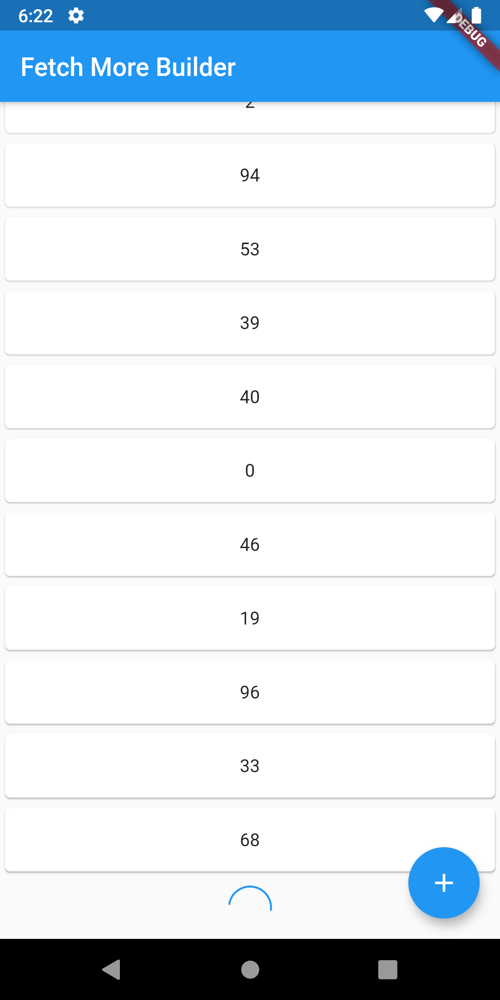

# fetch_more

I inspired from [Felix Angelov](https://twitter.com/felangelov)'s [flutter bloc examples](https://felangel.github.io/bloc/#/flutterinfinitelisttutorial)

A Flutter package that helps to collect and show data inside a ListView with a limit and fetch more when user needs more data.
Also has a RefreshIndicator that sends request with index zero.


## FetchMoreBuilder


````
        FetchMoreBuilder(
          itemBuilder: _itemBuilder,
          dataFetcher: _dataFetcher,
          limit: 20,
        )
````


## DataFetcher:

````
  Future<List<dynamic>> _dataFetcher(int index, int limit,
      [String searchTerm]) async {
    await Future.delayed(Duration(milliseconds: 1000));
    List list = [];
    if (index == 60) {
      // returning empty List tells to the FetchMoreBuilder data finished.
      return list;
    }
    for (int i = 0; i < limit; i++) {
      Random rdm = Random();
      list.add(rdm.nextInt(100));
    }
    return list;
  }

````
## ItemBuilder 

````
  Widget _itemBuilder(BuildContext context, List list, int index) {
    return Card(
      child: Container(
        height: 50,
        child: Center(
          child: Text(
            list.elementAt(index).toString(),
          ),
        ),
      ),
    );
  }
````




## Getting Started

This project is a starting point for a Dart
[package](https://flutter.dev/developing-packages/),
a library module containing code that can be shared easily across
multiple Flutter or Dart projects.

For help getting started with Flutter, view our 
[online documentation](https://flutter.dev/docs), which offers tutorials, 
samples, guidance on mobile development, and a full API reference.
